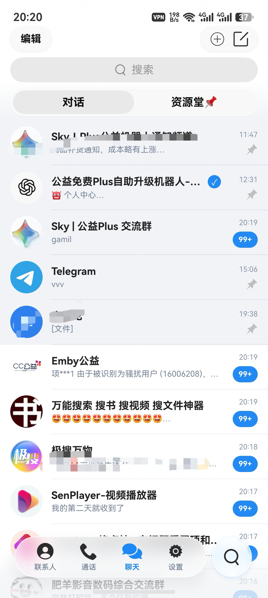
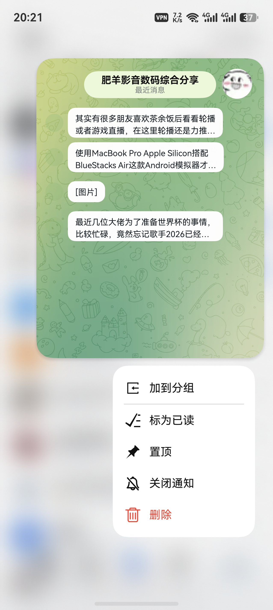
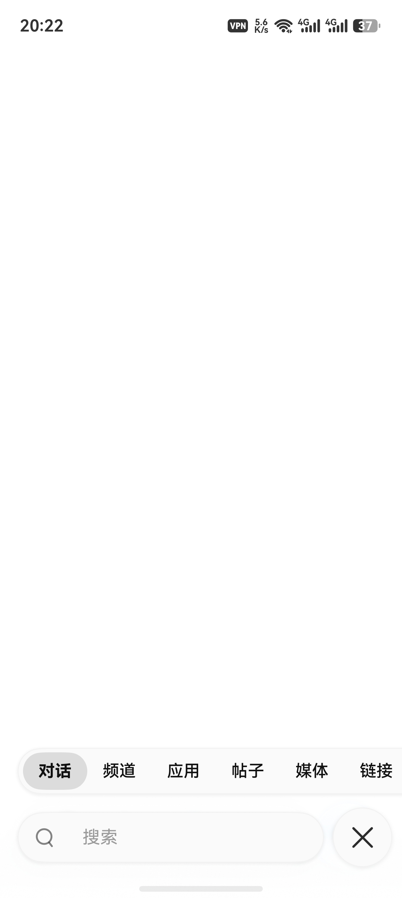

# Wpixelgram for HarmonyOS

HarmonyOS 即时通信客户端，基于 ArkTS、TDLib Native Bridge 和 AVPlayer/XComponent 开发。

## 功能

- 会话列表、消息详情、联系人、通话、设置页面。
- 支持文本、图片、视频、音频、文件、机器人按钮等消息内容。
- 支持手机、平板和大屏左右分栏。

## 实机截图

<table>
  <tr>
    <td></td>
    <td></td>
    <td></td>
    <td></td>
  </tr>
</table>

## 环境

- HarmonyOS SDK: `6.1.0(23)`
- DevEco Studio
- ArkTS / Native C++ / NAPI

## 配置

本地 API 配置放在：

```text
entry/src/main/resources/rawfile/
```

根据目录里的 `*.example.json` 创建本地配置文件，并填写自己的 `api_id` 和 `api_hash`。

注意：真实密钥、本地缓存、构建产物、编辑器交换文件不要提交到仓库。

## 构建

推荐使用 DevEco Studio 打开项目后直接构建运行。

## 说明

当前项目还在迭代中，重点关注消息同步、媒体播放、未读状态、存储统计和页面性能。
